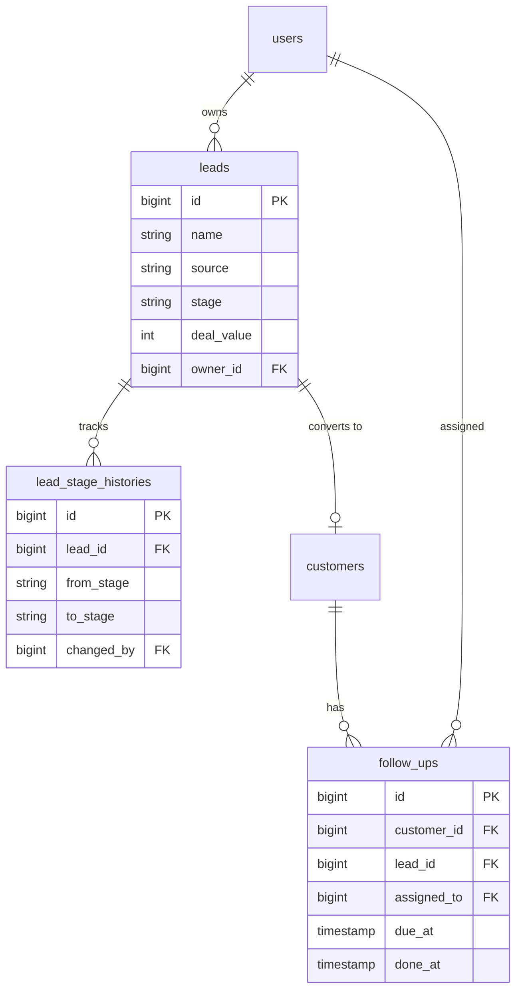

# Modern CRM

> Full-stack CRM — lead pipeline with stage history, customers, follow-up queues, analytics — a typed React 19 SPA over a Laravel 12 REST API.


## What's inside

- **Dashboard** — KPI cards (new leads, conversion rate, pipeline value, overdue follow-ups), an 8-week trend chart, conversion funnel, and source-performance report — every number computed server-side
- **Lead kanban** — six-stage board with drag-and-drop, optimistic updates that roll back on API rejection, search, create-lead modal, and a detail view showing the full stage history
- **Stage history** — every stage transition is written to `lead_stage_histories`, so "how did this deal get here" is always answerable
- **Convert to customer** — winning a lead promotes it to a customer in one call (idempotent — converting twice returns a typed `LEAD_ALREADY_CONVERTED` error)
- **Follow-ups** — overdue / today / upcoming / done queues with one-click complete
- **Auth** — JWT access tokens + rotating refresh tokens with reuse detection (from my [laravel-api-template](https://github.com/balajis-dev5/laravel-api-template)); roles: admin / manager / agent
- Dark mode, responsive layout, hand-rolled SVG charts (no chart library) using a CVD-validated palette

## Stack

React 19 · TypeScript (strict) · Vite · Tailwind CSS v4 · React Router — Laravel 12 · PHP 8.4 · SQLite/PostgreSQL · PHPUnit (30 tests)

## Quick start

```bash
# API
cd api && cp .env.example .env && composer install
php artisan key:generate
# set JWT_SECRET in .env (any long random string)
touch database/database.sqlite
php artisan migrate --seed && php artisan serve --port=8002

# Web (separate terminal)
cd web && npm install && npm run dev
```

Open http://localhost:5175 — sign in with `admin@example.com` / `password`
(the seeder creates 3 roles, 8 users, 400 leads with realistic stage history, ~80 customers, 180 follow-ups).

Docker (Postgres + Mailpit for the API): `cd api && docker compose up -d`.

## API

| Method | Endpoint | Notes |
|---|---|---|
| POST | `/api/v1/auth/login` `/refresh` `/logout` | JWT + rotating refresh, reuse detection |
| GET/POST/PATCH/DELETE | `/api/v1/leads` | Filter by `q`/`stage`/`source`/`owner_id`, sort, paginate |
| PATCH | `/api/v1/leads/{id}/stage` | Kanban move — writes stage history |
| POST | `/api/v1/leads/{id}/convert` | Promote to customer, marks lead won |
| GET/POST/PATCH/DELETE | `/api/v1/customers` | With open-follow-up counts |
| GET/POST/PATCH/DELETE | `/api/v1/follow-ups?bucket=overdue` | Buckets: overdue / today / upcoming / done |
| PATCH | `/api/v1/follow-ups/{id}/complete` | |
| GET | `/api/v1/analytics/dashboard` `/funnel` `/sources` `/leaderboard` | Single-query conditional aggregation |

Non-2xx responses share one envelope: `{ "message", "errors", "code" }` with machine-readable codes.

## Schema (core)



## Design decisions worth asking me about

- **Optimistic kanban** — the board updates instantly on drag; the `PATCH /stage` failure path restores the previous board state and surfaces the error. UI state is the cache, the API is the source of truth.
- **Funnel in one query** — conditional aggregation (`sum(case when …)`) ranks stages so a lead in `proposal` counts as having passed `contacted` and `qualified`. One round-trip instead of N.
- **Refresh-token rotation** — a stolen refresh token dies on first reuse: each refresh invalidates the old token and any reuse of it kills the whole token family.
- **Server-computed analytics** — the SPA never aggregates; it renders what `/analytics/*` returns, so the numbers are consistent everywhere and testable in PHPUnit.

## Tests

```bash
cd api && php artisan test   # 30 tests, 105 assertions
```

Covers the auth flow (login, refresh rotation, reuse detection), RBAC, lead CRUD + validation, stage-change history writes, double-convert rejection, follow-up buckets, and analytics numbers against known fixtures.

## Folder structure

```
modern-crm/
├── api/    # Laravel 12 — FormRequests, API Resources, thin controllers, PHPUnit
└── web/    # React 19 — pages + components + typed lib/api client (fetch, auto-refresh)
```

MIT License
